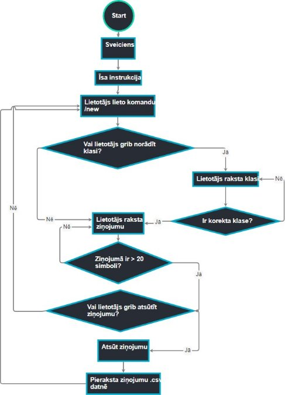
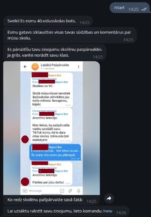
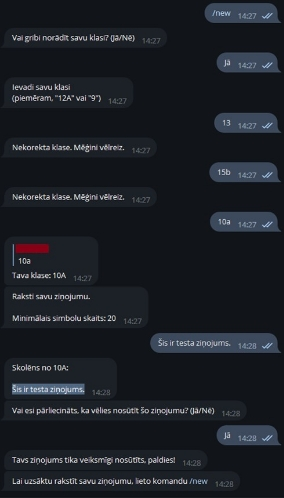
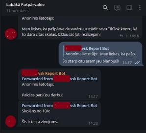
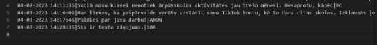

***Programmatūras projekta izstrāde***

(Programmēšana I-3.ieskaite)

Darba autors: Māris Troškins

Rīga, 2024

# Satura radītājs
[Īss apraksts	3](#_bookmark0)

[Problēmas izpēte un analīze	3](#_bookmark1)

[Reālās problēmas apraksts	3](#_bookmark2)

[Risinājuma mērķauditorija	4](#_bookmark3)

[Programmatūras prasību specifikācija	5](#_bookmark4)

[Programmatūras funkcijas apraksts	5](#_bookmark5)

[Programmatūras darbības blokshēma	6](#_bookmark6)

[Programmatūras izstrādes plāns	7](#_bookmark7)

[Lietotāja ceļvedis	7](#_bookmark8)

[Piemērotās licences pamatojums	8](#_bookmark9)

[Risinājuma realizācija	9](#_bookmark10)

# Īss apraksts
Projekta ideju man ierosināja viens mans draugs. Viņam ir dēls, kurš mācās vienā no Rīgas skolām. Viņa dēls ir skolas parlamenta loceklis, un viņiem bija  nepieciešams veids, kā iegūt anonīmu atgriezenisko saiti no skolēniem. Šis projekts ir *Telegram* bots, kas ļauj studentiem viegli un ērti sazināties ar skolēnu pašpārvaldi vai administrāciju.

Kods tika rakstīts *Python* valodā, izmantojot *telebot* bibliotēku. Bots nodrošina lietotājam draudzīgu saskarni ziņu sūtīšanai un saņemšanai. Bota mērķis ir uzlabot studentu pieredzi un iesaistīšanos, kā arī veicināt atgriezenisko saiti un sadarbību starp skolēniem un darbiniekiem.

# Problēmas izpēte un analīze
Reālās problēmas apraksts

Daudzi skolēni kautrējas vai baidās sniegt godīgas atsauksmes par skolu, kurā viņi mācās. Viņi var uztraukties par to, ka viņu skolotāji vai vienaudži viņus tiesās, kritizēs vai sodīs. Viņiem var arī šķist, ka skolas vadība viņu viedokli

nenovērtē vai nerespektē. Tas var izraisīt uzticēšanās un komunikācijas trūkumu starp skolēniem un skolu.

Manam risinājumam ir jāpalīdz viņiem pārvarēt šos šķēršļus un izteikties brīvi un anonīmi. Programmatūras risinājums var radīt drošu un konfidenciālu telpu, kurā skolēni var dalīties savās domās un jūtās par skolu, kā arī mudināt

skolēnus sniegt konstruktīvas atsauksmes un ieteikumus, kas var uzlabot skolas vidi un izglītības kvalitāti. Tas var arī palīdzēt skolas vadībai uzklausīt skolēnu atsauksmes un reaģēt uz tām savlaicīgi un efektīvi.

Risinājuma mērķauditorija

Šīs programmatūras risinājuma lietotāji ir skolēni, kuri vēlas ziņot par jebkādām problēmām, ieteikumiem, atsauksmēm vai sūdzībām skolas administrācijai vai skolēnu pašpārvaldei.

Jauniešu vidū ir populāra ziņojumapmaiņas lietotne *Telegram*. Šai platformai ir daudzas funkcijas un priekšrocības, kas padara to piemērotu šim projektam, proti:

- *Telegram* ir bezmaksas lietotne, uzstādama gan uz datora, gan uz

  viedtālruņa ar dažādām operētājsistēmām;

- lietotne ir viegli lietojama un intuitīvi saprotama;
- *Telegram* ir slavens ar augstu drošības un privātuma līmeni;
- tam ir jaudīgs API, kas ļauj izstrādātājiem izveidot pielāgotas

  programmatūras. Izstrādājot *Telegram* botu, izstrādātājiem nav jārūpējas par programmas dizainu vai elementu izkārtojumu, jo *Telegram* bota lietošana ir realizēta kā parasta tērzēšana ziņojumapmaiņas lietotnē.

# Programmatūras prasību specifikācija
Programmatūras funkcijas apraksts

1. Lietotājs var rakstīt ziņojumu tikai teksta formātā.
1. Programma jautā, vai lietotājs grib norādīt savu klasi.
   1. Ja lietotājs atteicas norādīt savu klasi, norādīt viņu kā “anonīmu lietotāju”.
   1. Ja lietotājs piekrist norādīt savu klasi, programma pārbauda, vai ievadīta klase var eksistēt (piem., klases “6B”, “9”, “1” ir korektas, bet “abc”, “178”, “13A”, “0” - nav)
1. Minimālais simbolu skaits lietotāja ziņojumā – 20.
1. Programma pārsūt lietotāja ziņojumu norādītā dialogā, kas ir domāts skolēnu pašpārvaldei. Tā filtrē ziņojumus un paziņo skolas

   administrācijai, veicinot saskarsmi starp skolēniem un skolotājiem.

   1. Ziņojumam jābūt anonīmam, t.i., neviens nevar redzēt ziņojuma autoru un viņa *Telegram* pseidonīmu.
1. Programma pieraksta atsūtītus ziņojumus .csv datnē, veidojot

   *darbību žurnālu* (*angl.* log).

Programmatūras darbības blokshēma

# Programmatūras izstrādes plāns
Ņemot vērā to, ka projekts ir aprakstīts kā ar skaidri definētiem prasībām un mērķiem, kas koncentrējas uz konkrētu funkciju kopumu, piemērotākais

izstrādes modelis būtu Ūdenskrituma modelis (*angl.* Waterfall model).

Ūdenskrituma modelis ir līnijveidīga pieeja programmatūras izstrādei, kur katru projektu posmu pabeidz pirms pārejas uz nākamo. Šis modelis ir piemērots projektam, kam ir skaidri definētas prasības un mērķi, un kur

projekta mērogs ir labi definēts.

Šajā projektā prasības ir skaidri definētas, un projekta mērogs ir

koncentrēts uz konkrētu funkciju kopumu. Tādēļ Ūdenskrituma modelis ir vispiemērotākais izstrādes modelis šim projektam.

# Lietotāja ceļvedis

1. Lai izmantotu programmu, lietotājam jāinstalē Telegram aplikācija un jāmeklē tālrunī programmas nosaukums.
1. Lietotājs ienāc dialogā ar botu (lieto saiti [*https://t.me/vsk_report_bot*](t.me/vsk_report_bot))*.*
1. Sākot dialogu, lietotājs ievada komandu */start*.
1. Lietotājs ievada komandu */new*.
1. Programma jautā, vai lietotājs vēlas norādīt savu klasi. Viņš atbild ar “jā” vai “nē”.

a. Ja lietotājs piekrist norādīt klasi, viņš to ievada.

1. Lietotājam ir jāievada ziņojums teksta formātā, kas sasniedz minimālo

   simbolu skaitu (20 simboli).

1. Uzrakstījis ziņojumu, lietotājs apstiprina, vai ziņojums tiks nosūtīts. Viņš atbild ar “jā” vai “nē”.

1. Ja lietotājs grib uzrakstīt jaunu ziņojumu, viņš ievada komandu */new* (sk. 4. - 7. p.)
# Piemērotās licences pamatojums

Šī projekta gadījumā piemērotākā licences izvēle ir CC-BY (*Creative Commons Attribution*).

Šī licences izmantošana ļauj citiem lietotājiem brīvi izplatīt un mainīt programmatūru, kā arī izmantot to komerciāli, ja tiek ievērots noteikums, ka oriģinālais autors ir pieminēts. Tas ir svarīgi, lai projekts būtu atvērtās koda kopienas pieejams un kā galvenais mērķis - nodrošinātu atvērto diskusiju un iespēju kopīgiem uzlabojumiem.

Šī licences izmantošana nodrošina arī to, ka projekta autors saglabā savas intelektuālās īpašumtiesības, bet tajā pašā laikā ļauj citiem izmantot

programmatūru un veikt to uzlabojumus. Turklāt, licences izmantošana veicina projekta izplatīšanos, jo tas var tikt atkārtoti izmantots citos projektos, padarot to vēl pieejamāku plašai auditorijai.

# Risinājuma realizācija

Tērzēšanas demonstrācija:

Bots pārsūt ziņojumu pašpārvaldes čatā:

Jauns ieraksts darbības žurnālā:

